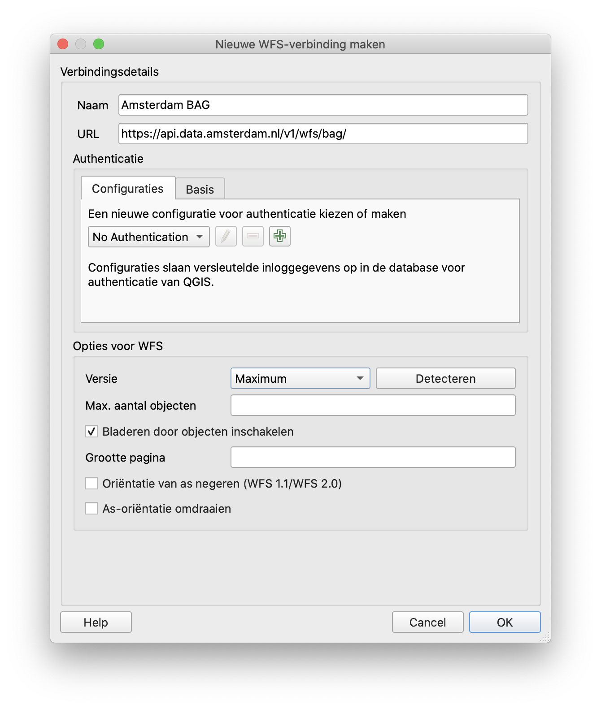
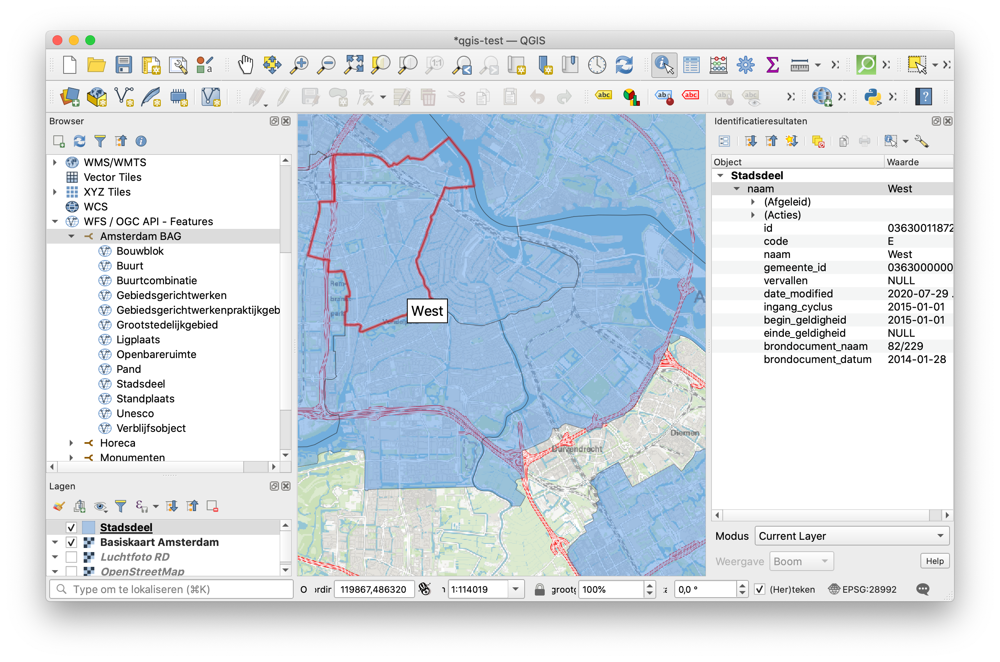

WFS Kaartlagen uitlezen
=======================

Alle "DSO API" diensten zijn ook als WFS feature beschikbaar.
Hiermee kunnen GIS-pakketten (zoals QGis) de ruimtelijke data direct visualiseren,
en queries op uitvoeren.

Verbinding leggen
-----------------

De WFS lagen zijn beschikbaar onder de volgende URL's:

:samp:`https://api.data.amsterdam.nl/v1/wfs/{<dataset naam>}/`

Gebruik zo'n URL in QGis:

   In de bovenstaande afbeelding wordt QGis gekoppeld met de BAG dataset:
   https://api.data.amsterdam.nl/v1/wfs/bag/

Hierna zijn de gegevens te raadplegen, te filteren en te combineren:

.. tip::
    De parameters ``?SERVICE=WFS&VERSION=2.0.0&REQUEST=..`` worden door QGis zelf achter de URL gezet.
    Hiet is niet nodig deze zelf toe te voegen.

Export formaten
---------------

De volgende export formaten zijn beschikbaar:

* GeoJSON
* CSV

Deze worden opgevraagd door zelf een **GetFeature** aanvraag samen te stellen.
Hiervoor zijn de parameters :samp:`TYPENAMES={laagnaam}` en :samp:`OUTPUTFORMAT={formaat}` nodig.
De volledige URL wordt dan:

:samp:`https://api.data.amsterdam.nl/v1/wfs/{dataset}/?SERVICE=WFS&VERSION=2.0.0&REQUEST=GetFeature&TYPENAMES={laagnaam}&OUTPUTFORMAT={formaat}`.

Bijvoorbeeld:

* `...&TYPENAMES=buurt&OUTPUTFORMAT=geojson <https://api.data.amsterdam.nl/v1/wfs/bag/?SERVICE=WFS&VERSION=2.0.0&REQUEST=GetFeature&TYPENAMES=buurt&COUNT=10&OUTPUTFORMAT=geojson>`_
* `...&TYPENAMES=buurt&OUTPUTFORMAT=csv <https://api.data.amsterdam.nl/v1/wfs/bag/?SERVICE=WFS&VERSION=2.0.0&REQUEST=GetFeature&TYPENAMES=buurt&COUNT=10&OUTPUTFORMAT=csv>`_

.. tip::
   In de bovenstaande links is een ``COUNT=`` parameter opgenomen, die paginering activeert.
   Door deze parameter weg te laten worden *alle objecten* in een enkele request opgehaald.
   De server kan voor de meeste datasets dit met een goede performance leveren.

Geometrie projectie
~~~~~~~~~~~~~~~~~~~

De exportlink kan uitgebreid worden met de ``SRSNAME`` parameter om geometrie velden in de gewenste projectie
te ontvangen. Bijvoorbeeld: ``SRSNAME=urn:ogc:def:crs:EPSG::3857`` voor de web-mercator projectie die
Google Maps gebruikt. De toegestane projecties zijn:

.. list-table::
    :widths: 30 70
    :header-rows: 1

    * - Projectie
      - Toelichting
    * - ``urn:ogc:def:crs:EPSG::28992``
      - Nederlandse rijksdriehoekscoördinaten (RD New).
    * - ``urn:ogc:def:crs:EPSG::4258``
      - ETRS89, Europese projectie.
    * - ``urn:ogc:def:crs:EPSG::3857``
      - Pseudo-Mercator (vergelijkbaar met Google Maps)
    * - ``urn:ogc:def:crs:EPSG::4326``
      - WGS 84 latitude-longitude, wereldwijd.

Queries op relaties
-------------------

Om object-relaties uit te lezen in de WFS server,
kan je de volgende optie toevoegen aan de URL:

* :samp:`?embed={relatienaam}` zal een veld platgeslagen invoegen.
* :samp:`?expand={relatienaam}` zal een veld als "complex feature" invoegen.

Gebruik deze URL in QGis, of een ander GIS-pakket.

Als voorbeeld: de BAG feature type *buurt* een relatie met een *stadsdeel*.
Deze kan op beide manieren geconfigureerd worden in een GIS-pakket:

* ``https://api.data.amsterdam.nl/v1/wfs/bag/?embed=stadsdeel`` levert een `stadsdelen met platgeslagen dot-notate <https://api.data.amsterdam.nl/v1/wfs/bag/?embed=stadsdeel&SERVICE=WFS&VERSION=2.0.0&REQUEST=GetFeature&TYPENAMES=buurt&COUNT=5>`_.
* ``https://api.data.amsterdam.nl/v1/wfs/bag/?expand=stadsdeel`` levert een `stadsdelen als complex feature <https://api.data.amsterdam.nl/v1/wfs/bag/?expand=stadsdeel&SERVICE=WFS&VERSION=2.0.0&REQUEST=GetFeature&TYPENAMES=buurt&COUNT=5>`_.

Deze parameters kunnen gecombineerd worden met de ``OUTPUTFORMAT`` parameter,
zodat het export formaat ook geneste relaties bevat.

.. admonition:: Embed of expand gebruiken?

   QGis 3 heeft geen ondersteuning voor complex features, en verwerkt deze als tekst.
   Gebruikt in QGis daarom alleen de platgeslagen versie met :samp:`?embed={...}`.
   De :samp:`?expand={...}` versie is daarentegen ideaal voor GeoJSON exports,
   die wel goed kan omgaan met geneste structuren.

XML uitvoer
~~~~~~~~~~~

Bij een platgeslagen relatie worden alle veldnamen met een punt erin opgebouwd:

.. code-block:: xml

    <app:buurt gml:id="buurt.03630000000078">
        <gml:name>00a</gml:name>
        <app:id>03630000000078</app:id>
        <app:code>00a</app:code>
        <app:naam>Kop Zeedijk</app:naam>
        <app:vollcode>A00a</app:vollcode>
        <app:geometrie>...
            <gml:Polygon srsName="urn:ogc:def:crs:EPSG::28992" gml:id="buurt.03630000000078.1">
                ...
            </gml:Polygon>
        </app:geometrie>
        <app:stadsdeel.id>03630000000018</app:stadsdeel.id>
        <app:stadsdeel.code>A</app:stadsdeel.code>
        <app:stadsdeel.naam>Centrum</app:stadsdeel.naam>
        <app:stadsdeel.vervallen xsi:nil="true" />
        <app:stadsdeel.date_modified>2020-07-28T22:25:24.197978+00:00</app:stadsdeel.date_modified>
        <app:stadsdeel.ingang_cyclus>2015-01-01</app:stadsdeel.ingang_cyclus>
        <app:stadsdeel.begin_geldigheid>2015-01-01</app:stadsdeel.begin_geldigheid>
        <app:stadsdeel.einde_geldigheid xsi:nil="true" />
        <app:stadsdeel.brondocument_naam>3B/2015/134</app:stadsdeel.brondocument_naam>
        <app:stadsdeel.brondocument_datum>2015-06-23</app:stadsdeel.brondocument_datum>
        <app:stadsdeel_id>03630000000018</app:stadsdeel_id>
        <app:vervallen xsi:nil="true" />
        <app:date_modified>2020-07-28T22:25:32.261814+00:00</app:date_modified>
        <app:ingang_cyclus>2006-06-12</app:ingang_cyclus>
        <app:begin_geldigheid>2006-06-12</app:begin_geldigheid>
        <app:buurtcombinatie_id>3630012052036</app:buurtcombinatie_id>
        <app:einde_geldigheid xsi:nil="true" />
        <app:brondocument_naam />
        <app:brondocument_datum xsi:nil="true" />
        <app:gebiedsgerichtwerken_id>DX01</app:gebiedsgerichtwerken_id>
    </app:buurt>

Bij een "complex feature" gebruikt de XML uitvoer een eigen ``<app:stadsdeel>`` object:

.. code-block:: xml

    <app:buurt gml:id="buurt.03630000000078">
        <gml:name>00a</gml:name>
        <app:id>03630000000078</app:id>
        <app:code>00a</app:code>
        <app:naam>Kop Zeedijk</app:naam>
        <app:vollcode>A00a</app:vollcode>
        <app:geometrie>...
            <gml:Polygon srsName="urn:ogc:def:crs:EPSG::28992" gml:id="buurt.03630000000078.1">
                ...
            </gml:Polygon>
        </app:geometrie>
        <app:stadsdeel>
            <app:id>03630000000018</app:id>
            <app:code>A</app:code>
            <app:naam>Centrum</app:naam>
            <app:vervallen xsi:nil="true" />
            <app:date_modified>2020-07-28T22:25:24.197978+00:00</app:date_modified>
            <app:ingang_cyclus>2015-01-01</app:ingang_cyclus>
            <app:begin_geldigheid>2015-01-01</app:begin_geldigheid>
            <app:einde_geldigheid xsi:nil="true" />
            <app:brondocument_naam>3B/2015/134</app:brondocument_naam>
            <app:brondocument_datum>2015-06-23</app:brondocument_datum>
        </app:stadsdeel>
        <app:stadsdeel_id>03630000000018</app:stadsdeel_id>
        <app:vervallen xsi:nil="true" />
        <app:date_modified>2020-07-28T22:25:32.261814+00:00</app:date_modified>
        <app:ingang_cyclus>2006-06-12</app:ingang_cyclus>
        <app:begin_geldigheid>2006-06-12</app:begin_geldigheid>
        <app:buurtcombinatie_id>3630012052036</app:buurtcombinatie_id>
        <app:einde_geldigheid xsi:nil="true" />
        <app:brondocument_naam></app:brondocument_naam>
        <app:brondocument_datum xsi:nil="true" />
        <app:gebiedsgerichtwerken_id>DX01</app:gebiedsgerichtwerken_id>
    </app:buurt>

Relaties bij exportformaten
~~~~~~~~~~~~~~~~~~~~~~~~~~~

De exportformaten ondersteunen tevens het embedden/nesten van relaties.
Hiervoor is het voldoende om de nesting-parameters te gebruiken bij het export links.

Bijvoorbeeld:

* `?embed=stadsdeel&...&TYPENAMES=buurt&OUTPUTFORMAT=geojson  <https://api.data.amsterdam.nl/v1/wfs/bag/?embed=stadsdeel&SERVICE=WFS&VERSION=2.0.0&REQUEST=GetFeature&TYPENAMES=buurt&COUNT=10&OUTPUTFORMAT=geojson>`_
* `?expand=stadsdeel&...&TYPENAMES=buurt&OUTPUTFORMAT=geojson  <https://api.data.amsterdam.nl/v1/wfs/bag/?expand=stadsdeel&SERVICE=WFS&VERSION=2.0.0&REQUEST=GetFeature&TYPENAMES=buurt&COUNT=10&OUTPUTFORMAT=geojson>`_
* `?embed=stadsdeel&...&TYPENAMES=buurt&OUTPUTFORMAT=csv <https://api.data.amsterdam.nl/v1/wfs/bag/?embed=stadsdeel&SERVICE=WFS&VERSION=2.0.0&REQUEST=GetFeature&TYPENAMES=buurt&COUNT=10&OUTPUTFORMAT=csv>`_
* `?expand=stadsdeel&...&TYPENAMES=buurt&OUTPUTFORMAT=csv <https://api.data.amsterdam.nl/v1/wfs/bag/?expand=stadsdeel&SERVICE=WFS&VERSION=2.0.0&REQUEST=GetFeature&TYPENAMES=buurt&COUNT=10&OUTPUTFORMAT=csv>`_

.. admonition:: Sommige formaten hebben beperkingen

    De CSV export kan alleen complexe relaties verwerken als deze ook platgeslagen kunnen worden.
    Dit is een beperking van het bestandsformaat zelf.

Datasets met meerdere geometrieën
---------------------------------

Indien een tabel meerdere geometriëen bevat, zal deze voor ieder geometrie veld los opgenomen worden in de WFS.
Zodoende kunnen GIS-pakketten op beide geometriën weergeven op de kaart.

Dit is bijvoorbeeld te zien bij Horeca-exploitatievergunningen: er wordt een aparte laag voor het pand,
en de bijbehorende terassen beschikbaar gesteld. Zodoende kunnen beide geometriën uitgelezen worden.
De data van beide lagen is identiek; alleen de volgorde van geometrie-velden is aangepast.

Technische implementatie
------------------------

De WFS server is gebouwd op basis van `django-gisserver <https://django-gisserver.readthedocs.io>`_.
Deze Django module ondersteunt het "Basic WFS" conformance level, en is getest op compatibiliteit met de
`CITE Teamengine Test Suite <https://cite.opengeospatial.org/teamengine/>`_.
